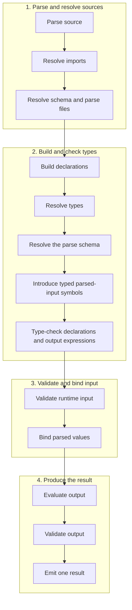

# Mace Language Specification

## 1. Status, conformance, and processing model

This RFC is normative. [`mace.ebnf`](./mace.ebnf) is the canonical syntax.
A conforming implementation MUST implement both that grammar and the static and
evaluation semantics in this RFC. Where the output grammar is contextual, the
selected output mode determines the applicable field production before fields
are interpreted.

Mace is a deterministic, strongly typed configuration language. Evaluation is
pure. A processor MUST emit exactly one fully validated record or schema result,
or an error. It MUST NOT emit partial output. Output roots MUST be records.
Variables are immutable, explicitly typed, and initialized. Mace has no loops,
functions, mutation, array indexing, arbitrary host calls, shell execution, or
unrestricted network or filesystem access.

Processing occurs in this observable order:



Source MUST be UTF-8. Line endings may be LF, CRLF, or CR; CRLF is one newline.

## 2. Canonical grammar

The following fenced block MUST be an exact copy of `mace.ebnf`.

```ebnf
(* Mace canonical grammar. Semantic constraints are normative where noted. *)

(* LEXICAL STRUCTURE *)
whitespace = " " | "\t" | newline ;
newline = "\r\n" | "\n" | "\r" ;
line_comment = "//" , { ? any character except a line terminator ? } ;
block_comment = "/*" , { ? any character sequence not containing "*/" ? } , "*/" ;
comment = line_comment | block_comment ;
ws0 = { whitespace | comment } ;
ws1 = ( whitespace | comment ) , ws0 ;

unicode_letter = ? any Unicode character in category Letter ? ;
unicode_digit = ? any Unicode character in category Number, decimal digit ? ;
digit = "0" | "1" | "2" | "3" | "4" | "5" | "6" | "7" | "8" | "9" ;
hex_digit = digit | "a"…"f" | "A"…"F" ;
identifier_part = unicode_letter | unicode_digit | "_" ;
identifier =
    unicode_letter ,
    { identifier_part } ,
    { "-" , identifier_part , { identifier_part } } ;

inline_description = "/#" , ws0 , description_text ;
description_text =
    ? text up to, but not including, a comma, semicolon, closing brace, or line terminator ? ;

single_string = "'" , { single_character } , "'" ;
double_string = '"' , { double_part } , '"' ;
block_string = '"""' , { block_part } , '"""' ;
string_literal = single_string | double_string | block_string ;
single_character =
    ? any character except ', a line terminator, or backslash ?
  | escape_sequence ;
double_part =
    ? any character except ", a line terminator, backslash, or the start of "$(" ?
  | escape_sequence
  | interpolation ;
block_part =
    ? any character except backslash that does not begin the terminator or an interpolation ?
  | escape_sequence
  | interpolation ;

literal_single_string = "'" , { literal_single_character } , "'" ;
literal_double_string = '"' , { literal_double_character } , '"' ;
literal_block_string = '"""' , { literal_block_character } , '"""' ;
literal_string = literal_single_string | literal_double_string | literal_block_string ;
literal_single_character =
    ? any character except ', a line terminator, or backslash ?
  | escape_sequence ;
literal_double_character =
    ? any character except ", a line terminator, or backslash ?
  | escape_sequence ;
literal_block_character =
    ? any character except backslash, not beginning '"""' ?
  | escape_sequence ;
escape_sequence = "\\" , ( "\\" | "'" | '"' | "n" | "r" | "t" | unicode_escape ) ;
unicode_escape =
    "u" , hex_digit , hex_digit , hex_digit , hex_digit
  | "U" , hex_digit , hex_digit , hex_digit , hex_digit ,
          hex_digit , hex_digit , hex_digit , hex_digit ;

path_literal = "'" , { path_character } , "'" ;
path_character = ? any character except ', a line terminator, or backslash ? ;

int_literal = digit , { digit } ;
float_literal = digit , { digit } , "." , digit , { digit } ;
hex_int_literal = ( "0x" | "0X" ) , hex_digit , { hex_digit } ;
hex_float_literal =
    ( "0x" | "0X" ) , hex_digit , { hex_digit } , "." , hex_digit , { hex_digit } ;
boolean_literal = "true" | "false" ;
null_literal = "null" ;

(* DOCUMENT STRUCTURE *)
mace_file = ws0 , [ script_block , ws0 ] , output_block , ws0 ;
script_block =
    script_delimiter , ws0 ,
    { import_declaration , ws0 } ,
    { declaration , ws0 } ,
    script_delimiter ;
script_delimiter = "|" , "=" , "=" , "=" , { "=" } , "|" ;
(* Opening and closing script delimiters MUST contain equal numbers of '='. *)

import_declaration =
    "from" , ws1 , path_literal , ws1 ,
    ( "import" , ws1 , import_list | "bind" , ws1 , identifier ) ,
    ws0 , ";" ;
import_list = imported_identifier , { ws0 , "," , ws0 , imported_identifier } ;
imported_identifier = identifier , [ ws0 , ":" , ws0 , identifier ] ;

declaration =
    variable_declaration
  | type_declaration
  | schema_declaration
  | gen_doc_declaration
  | schema_doc_declaration ;
variable_declaration =
    type_reference , ws1 , identifier , ws0 , "=" , ws0 , expression ,
    [ ws0 , inline_description ] , ws0 , ";" ;
type_declaration =
    "alias" , ws1 , identifier , ws0 , ":" , ws0 , type_reference ,
    [ ws0 , inline_description ] , ws0 , ";" ;
schema_declaration =
    "schema" , ws1 , identifier , ws0 , ":" , ws0 , record_type , ws0 , ";" ;

gen_doc_declaration =
    "gen_doc" , ws1 , identifier , ws0 , "{" , ws0 ,
    [ gen_doc_entry , { ws0 , "," , ws0 , gen_doc_entry } , [ ws0 , "," ] ] ,
    ws0 , "}" , ws0 , ";" ;
gen_doc_entry =
    "summary" , ws0 , ":" , ws0 , literal_string
  | "description" , ws0 , ":" , ws0 , literal_block_string ;
schema_doc_declaration =
    "schema_doc" , ws1 , identifier , ws0 , "{" , ws0 ,
    [ schema_doc_entry , { ws0 , "," , ws0 , schema_doc_entry } , [ ws0 , "," ] ] ,
    ws0 , "}" , ws0 , ";" ;
schema_doc_entry =
    "summary" , ws0 , ":" , ws0 , literal_string
  | "description" , ws0 , ":" , ws0 , literal_block_string
  | "fields" , ws0 , ":" , ws0 , "{" , ws0 ,
    [ documentation_field ,
      { ws0 , "," , ws0 , documentation_field } , [ ws0 , "," ] ] ,
    ws0 , "}" ;
documentation_field = identifier , ws0 , ":" , ws0 , literal_string ;

(* TYPES *)
type_reference =
    primitive_type
  | array_type
  | record_map_type
  | record_type
  | fusion_type
  | variant_type
  | choice_type
  | identifier ;
primitive_type = "string" | "int" | "float" | "hex_int" | "hex_float" | "boolean" ;
array_type = "array" , ws0 , "<" , ws0 , schema_type_reference , ws0 , ">" ;
record_map_type = "record" , ws0 , "<" , ws0 , schema_type_reference , ws0 , ">" ;
record_type =
    "{" , ws0 ,
    [ schema_field , { ws0 , "," , ws0 , schema_field } , [ ws0 , "," ] ] ,
    ws0 , "}" ;
schema_field =
    identifier , [ "?" ] , ws0 , ":" , ws0 , schema_type_reference ,
    [ ws0 , inline_description ] ;
schema_type_reference = type_reference | self_type_reference ;
self_type_reference = "$self" ;
fusion_type =
    "fusion" , ws0 , "[" , ws0 , type_reference ,
    { ws0 , "," , ws0 , type_reference } , [ ws0 , "," ] , ws0 , "]" ;
variant_type =
    "variant" , ws0 , "[" , ws0 , type_reference ,
    { ws0 , "," , ws0 , type_reference } , [ ws0 , "," ] , ws0 , "]" ;
choice_type =
    "choice" , ws0 , "[" , ws0 , choice_member ,
    { ws0 , "," , ws0 , choice_member } , [ ws0 , "," ] , ws0 , "]" ;
choice_member =
    literal_string
  | int_literal
  | float_literal
  | hex_int_literal
  | hex_float_literal
  | boolean_literal ;

(* OUTPUT *)
output_block =
    [ output_directive_list , ws0 ] ,
    "{" , ws0 , [ output_field_list ] , ws0 , "}" ;
(* output_field_list is contextual: data mode selects data_output_field_list;
   schema mode selects schema_output_field_list. *)
output_field_list = data_output_field_list | schema_output_field_list ;
data_output_field_list =
    data_output_field ,
    { ws0 , "," , ws0 , data_output_field } , [ ws0 , "," ] ;
schema_output_field_list =
    schema_output_field ,
    { ws0 , "," , ws0 , schema_output_field } , [ ws0 , "," ] ;
output_directive_list =
    "[" , ws0 , directive_pair ,
    { ws0 , "," , ws0 , directive_pair } , ws0 , "]" ;
directive_pair =
    "output" , ws0 , "=" , ws0 , ( "'data'" | "'schema'" )
  | "schema" , ws0 , "=" , ws0 , identifier
  | "schema_file" , ws0 , "=" , ws0 , path_literal
  | "parse" , ws0 , "=" , ws0 , identifier
  | "parse_file" , ws0 , "=" , ws0 , path_literal
  | "description" , ws0 , "=" , ws0 , expression ;
data_output_field =
    identifier , ws0 , ":" , ws0 , ( expression | null_literal ) ,
    [ ws0 , inline_description ]
  | identifier , [ ws0 , inline_description ] ;
schema_output_field =
    identifier , [ "?" ] , ws0 , ":" , ws0 , type_reference ,
    [ ws0 , inline_description ] ;

(* EXPRESSIONS *)
expression = conditional_expression ;
conditional_expression =
    coalescing_expression ,
    [ ws0 , "?" , ws0 , coalescing_expression ,
      ws0 , ":" , ws0 , coalescing_expression ] ;
coalescing_expression =
    logical_or_expression , [ ws0 , "??" , ws0 , coalescing_expression ] ;
logical_or_expression =
    logical_and_expression , { ws0 , "||" , ws0 , logical_and_expression } ;
logical_and_expression =
    bitwise_or_expression , { ws0 , "&&" , ws0 , bitwise_or_expression } ;
bitwise_or_expression =
    bitwise_xor_expression , { ws0 , "|" , ws0 , bitwise_xor_expression } ;
bitwise_xor_expression =
    bitwise_and_expression , { ws0 , "^" , ws0 , bitwise_and_expression } ;
bitwise_and_expression =
    equality_expression , { ws0 , "&" , ws0 , equality_expression } ;
equality_expression =
    relational_expression ,
    { ws0 , ( "==" | "!=" ) , ws0 , relational_expression } ;
relational_expression =
    shift_expression ,
    { ws0 , ( "<" | "<=" | ">" | ">=" ) , ws0 , shift_expression } ;
shift_expression =
    additive_expression ,
    { ws0 , ( "<<" | ">>" | ">>>" ) , ws0 , additive_expression } ;
additive_expression =
    multiplicative_expression ,
    { ws0 , ( "+" | "-" ) , ws0 , multiplicative_expression } ;
multiplicative_expression =
    exponent_expression ,
    { ws0 , ( "*" | "/" | "%" ) , ws0 , exponent_expression } ;
exponent_expression =
    unary_expression , [ ws0 , "**" , ws0 , exponent_expression ] ;
unary_expression =
    ( "!" | "~" | "+" | "-" ) , ws0 , unary_expression
  | postfix_expression ;
postfix_expression = primary_atom , { postfix_suffix } ;
primary_atom =
    identifier
  | self_reference
  | parsed_input_reference
  | int_literal
  | float_literal
  | hex_int_literal
  | hex_float_literal
  | string_literal
  | boolean_literal
  | array_literal
  | record_literal
  | match_expression
  | grouped_expression ;
postfix_suffix = ws0 , ( "." | "?." ) , ws0 , identifier ;
self_reference = "$self" , "." , identifier , { "." , identifier } ;
parsed_input_reference = "$" , identifier ;
grouped_expression = "(" , ws0 , expression , ws0 , ")" ;
(* Grouping is valid only when it changes arithmetic precedence or associativity. *)
array_literal =
    "[" , ws0 ,
    [ expression , { ws0 , "," , ws0 , expression } , [ ws0 , "," ] ] ,
    ws0 , "]" ;
record_literal =
    "{" , ws0 ,
    [ record_field , { ws0 , "," , ws0 , record_field } , [ ws0 , "," ] ] ,
    ws0 , "}" ;
record_field =
    identifier , ws0 , ":" , ws0 , expression , [ ws0 , inline_description ]
  | identifier , [ ws0 , inline_description ] ;
match_expression =
    "match" , ws0 , "(" , ws0 , expression , ws0 , ")" , ws0 ,
    "{" , ws0 , match_arm , { ws0 , match_arm } , ws0 , "}" ;
match_arm = match_pattern , ws0 , "=>" , ws0 , expression , ws0 , "," ;
match_pattern = type_reference | choice_member ;
interpolation = "$" , "(" , expression , ")" ;
```

## 3. Lexical rules

### 3.1 Identifiers and keywords

Identifiers are case-sensitive and use the grammar's Unicode categories.
Hyphenated segments may begin with a letter, decimal digit, or underscore.
Consequently `用户配置`, `naïve-value`, `foo-1`, and `foo-_internal` are valid.
Processors MUST compare identifier spelling by exact Unicode code-point sequence;
they MUST NOT normalize spelling. Thus canonically equivalent NFC and NFD
spellings are distinct identifiers. Tools SHOULD warn when visually confusable or
non-normalized names occur, but MUST NOT silently rewrite them.

The globally reserved complete-token keywords are `from`, `import`, `bind`,
`alias`, `schema`, `gen_doc`, `schema_doc`, `array`, `record`, `fusion`,
`variant`, `choice`, `match`, `string`, `int`, `float`, `hex_int`, `hex_float`,
`boolean`, `true`, `false`, and `null`. `output`, `schema_file`, `parse`,
`parse_file`, `description`, `data`, `summary`, and `fields` are contextual
in their corresponding constructs. A keyword matches only a complete identifier
token: `matcher` is one identifier, not `match` followed by `er`. Contextual
keywords MAY be field names where the field grammar is unambiguous. A globally
reserved word used where an identifier is required is a syntax error.

Positive: `{ matcher: 1, output: 2, }`. Negative: `int match = 1;`.

### 3.2 Comments, strings, and descriptions

`//` comments end at a line ending or EOF. `/* ... */` comments end at the next
`*/` and do not nest. Double and block strings interpolate only with
`$(expression)`; single strings never interpolate. Backslashes in every string
form are consumed only by `escape_sequence`.

Choice members and structured documentation use `literal_string`; interpolation
in either location is forbidden. The data-output `description` directive is the sole
documentation location that evaluates an expression, which MUST produce a
string. A path is a single-line, non-interpolated, single-quoted `path_literal`.

Positive:

```mace
alias Mode: choice['dev', "prod", """test"""];
gen_doc Mode { summary: "Deployment mode", };
```

Negative: `alias Mode: choice["$(environment)"];` and
`gen_doc Mode { summary: "$(environment)", };`.

An inline description begins with `/#` and ends immediately before `,`, `;`, `}`,
or a line ending. The enclosing construct consumes that delimiter. It may annotate
a variable, alias, schema or inline-record field, runtime record field, or output
field. It MUST NOT consume a declaration terminator or closing brace.

```mace
string name = "Mace" /# before semicolon;
schema User: { name: string /# before comma, age?: int /# before brace };
{ name: "Mace" /# before output brace }
```

A second inline description on the same construct is invalid.

## 4. Document structure, declarations, and types

A file contains zero or one script block followed by exactly one output block.
Opening and closing script delimiters MUST have equal lengths. Imports precede
all declarations. Import, variable, alias, schema, and documentation declarations
MUST end in `;`. Variables are initialized exactly once and MUST accept their
initializer's static type.

Primitive types are `string`, `int`, `float`, `hex_int`, `hex_float`, and
`boolean`. Arrays are homogeneous unless their declared element is a permitting
variant. `record<T>` maps identifier keys to `T`. Schemas and inline record types
are closed: required fields are present, optional fields may be absent, and
unknown fields are errors. `?` is a schema-shape marker, never a runtime field
marker.

An empty collection requires an expected type. Every empty collection in a data
output, including one nested in a conditional, MUST obtain that type from the
selected output schema. A variable initializer may obtain it from its declared
type. Empty schemas remain valid.

A fusion resolves entirely to records or entirely to choices. Record fusion
merges equal field types; required plus optional is required. Conflicting types
are errors. Choice fusion deduplicates the union of literal domains. A fusion
MUST NOT mix record and choice domains. Pure alias cycles are invalid. `$self` in
a schema type is legal only behind a structural guard such as `array<$self>`;
direct recursion and use outside a schema are errors.

## 5. Choices, variants, and matching

A choice is a non-empty, compile-time set of distinct scalar literals. Its
strings MUST be non-interpolating. A variant is an unordered set of distinct
resolved member types. Primitive/choice overlap is preserved: in
`variant[string, choice["dev", "prod"]]`, the choice owns `"dev"` and `"prod"`
and `string` denotes the residual string domain.

### 5.1 Pattern domains and specificity

A pattern has a declared domain and an effective domain:

* A literal pattern's declared domain is exactly that literal.
* A choice pattern's declared domain is its resolved literal set.
* Another type pattern's declared domain is its resolved type domain.
* Specificity is `individual choice literal > choice type > overlapping primitive`.
* A pattern's effective domain is its declared domain intersected with the source
  domain, minus every applicable more-specific pattern domain.

Source order MUST NOT affect static analysis or runtime selection. Equivalent
patterns are duplicates. Equal-specificity patterns with intersecting effective
domains are errors. A pattern outside the source domain is an error. Every
non-empty effective portion of the source domain MUST be covered exactly once.
A choice value MUST be covered by a choice pattern or individual literal patterns;
it MUST NOT fall through to an overlapping primitive pattern.

Patterns introduce no binding. If the matched expression is a stable variable or
member path, that path is narrowed to the selected arm's effective domain while
the arm result is checked. The input is evaluated once. Arm result types use the
conditional result-type rule in Section 8. Runtime selection chooses the unique
most-specific applicable arm.

Normal disjoint variant:

```mace
variant[string, int] value = 7;
string kind = match (value) { string => "text", int => "number", };
```

Literal, choice, and primitive together (the same behavior applies in any arm
order):

```mace
variant[string, choice["dev", "prod"]] mode = "dev";
string result = match (mode) {
    string => "custom",
    choice["dev", "prod"] => "known",
    "dev" => "development",
};
```

`"dev"` selects the literal, `"prod"` the choice, and `"staging"` residual
`string`. A variant literal is valid only if it belongs to a choice member.

Negative examples:

```mace
// Missing "prod"; string cannot absorb it.
match (mode) { string => "custom", "dev" => "development", };

// Unrelated literal.
match (mode) { string => "custom", choice["dev", "prod"] => "known", "qa" => "bad", };

// Equal-specificity overlap.
match (mode) {
    choice["dev", "prod"] => "one",
    choice["prod", "test"] => "two",
    string => "custom",
};
```

A direct choice match is exhaustive over its literals:

```mace
choice["on", "off"] state = "on";
int enabled = match (state) { "on" => 1, "off" => 0, };
```

## 6. Output modes, shorthand, and `null`

Without directives, output mode is data. A bracketed list MUST contain exactly
one `output` directive. Unknown and duplicate directives are errors. In schema
mode, fields use `schema_output_field`: right sides are types, `?` is allowed,
and shorthand and `null` are forbidden. In data mode, fields use
`data_output_field`: right sides are expressions or direct `null`, and `?` is
forbidden. `schema`, `schema_file`, `parse`, and `parse_file` are invalid in
schema mode.

A shorthand runtime record or data-output field `{ name }` is exactly
`{ name: name }`. It resolves one immutable value named `name` in the ordinary
local/imported value namespace. It does not search nested records, `$self`, or
parsed input. Parsed input therefore requires `$name`; `$self` requires an
explicit path. An unknown shorthand identifier is an error. Schema output never
permits shorthand.

Positive: `string name = "Mace"; ... { name }` and an imported value shorthand.
Negative: `{ userName }` when only `$userName` or `$self.userName` exists.

`null` is not an expression or runtime value. It is legal only as the direct
value of a data-output field:

```mace
{ obsolete: null, }
```

The field expression is not evaluated and no null value is created. The field is
omitted before final output-schema validation. Omission succeeds for an optional
field and fails when the selected schema requires that field.

```mace
schema Result: { obsolete?: string, };
[output = 'data', schema = Result] { obsolete: null, } // valid
```

Invalid uses include `int value = null;`, `{ values: [null], }`,
`{ nested: { value: null }, }`, `{ result: enabled ? 1 : null, }`,
`{ same: null == null, }`, interpolation, and either side of `??`.

## 7. Imports, file directives, and paths

`from 'file.mace' import Name;` imports one exposed symbol under its name.
`import Name:LocalName;` imports it under `LocalName`. Ordinary imports can see
only symbols intentionally exposed by the referenced output: data-output fields
from a data file and schema-output fields/types from a schema file. Script
variables, aliases, schemas, and documentation are private unless represented by
an exposed output field. Duplicate local names, duplicate imports, missing
exposed names, and local declarations shadowing imports are errors.

`from 'file.mace' bind Name;` processes a referenced data-output file completely
and binds its output record as one immutable local value `Name`. Binding a
schema-output file is invalid. The referenced file must process successfully;
otherwise `bind` fails without creating a value.

```mace
from 'service.mace' import port;
from 'service.mace' import host:service-host;
from 'service.mace' bind service;
```

`schema_file = 'file.mace'` requires a schema-output file. Its output body is the
active output shape when `schema` is absent. When `schema = Name` is also present,
`Name` is resolved only among named schemas loaded from that same file; unrelated
local declarations are not candidates. `parse_file` behaves in parallel for
runtime input: without `parse`, its schema-output body is the input shape; with
`parse = Name`, the name resolves only in that file. File declarations needed to
resolve the selected exported schema are available internally but do not enter
the caller's namespace. Name collisions therefore cannot be resolved by leaking
private declarations. Wrong output mode, absent selection, duplicate selection,
or an incompatible directive combination is an error.

A `schema` or `parse` without its corresponding file resolves in the current
file's local named schemas. `schema_file` and `parse_file` relationships,
imports, and binds all participate in one dependency graph; any cycle is an
error.

Every path MUST end in `.mace` and resolves relative to its containing file.
Before access, processors normalize separators and `.`/`..`, resolve symlinks,
canonicalize target and project root, and reject targets outside the canonical
root. Raw string-prefix containment is insufficient.

Positive cases include named/renamed imports, binding a data file, and each file
directive with or without its selector. Negative cases include binding a schema
file, collisions, missing selections, wrong modes, cycles, `..` escapes, and
symlink escapes.

## 8. Expressions and operators

Operands evaluate left-to-right except where laziness is stated. Checked
operations MUST report an operator/type, overflow, division, shift, exponent, or
non-finite-result diagnostic as applicable. Decimal (`int`, `float`) and
hexadecimal (`hex_int`, `hex_float`) families MUST NOT mix. Within one family,
integer/float arithmetic promotes the integer operand to that family's float.
No other implicit numeric conversion occurs.

| Operators | Operands | Result | Precedence | Associativity / evaluation |
| --- | --- | --- | ---: | --- |
| `.`, `?.` | record/schema target and member | member type; `?.` produces possible absence | 15 | left; target first |
| `!` | `boolean` | `boolean` | 14 | right |
| `~` | `int` only | `int` | 14 | right |
| unary `+`, `-` | any numeric scalar | same type | 14 | right; checked for integer minimum negation |
| `**` | same-family numeric scalars | promoted family type | 13 | right; see below |
| `*`, `/`, `%` | same-family numeric scalars | promoted type, except `int/int → int`, `hex_int/hex_int → hex_float` for `/` | 12 | left |
| `+`, `-` | same-family numeric scalars; `string + string` | promoted numeric type or `string` | 11 | left |
| `<<`, `>>`, `>>>` | left `int` or `hex_int`; right `int` | left type | 10 | left |
| `<`, `<=`, `>`, `>=` | same-family numeric scalars or `string/string` | `boolean` | 9 | left |
| `==`, `!=` | same static type | `boolean` | 8 | left; deep arrays/records |
| `&` | `int/int` or `hex_int/hex_int` | operand type | 7 | left |
| `^` | `int/int` or `hex_int/hex_int` | operand type | 6 | left |
| `|` | `int/int` or `hex_int/hex_int` | operand type | 5 | left |
| `&&` | `boolean/boolean` | `boolean` | 4 | left, lazy right |
| `||` | `boolean/boolean` | `boolean` | 3 | left, lazy right |
| `??` | possibly absent left; compatible present right | unified present type | 2 | right; lazy right |
| `?:` | boolean condition; compatible branches | branch union described below | 1 | right syntactically; selected branch only |

Booleans have no bitwise operators. String concatenation and Unicode code-point
lexicographic ordering are supported only for two strings. Equality across
distinct types is invalid. Array equality is ordered element equality; record
equality requires equal key sets and recursively equal values. Choice values
compare according to their underlying scalar only when both operands have the
same declared choice type.

All `int` and `hex_int` arithmetic, unary negation, exponentiation, and left shift
are checked against signed 64-bit range and MUST NOT wrap. Integer division
truncates toward zero. Integer remainder satisfies `a == (a / b) * b + a % b`
and has the dividend's sign. Division or remainder by zero is an error.

Exponentiation accepts an integer-valued exponent. Integer bases require a
non-negative `int` exponent. Float bases accept integer-valued positive or
negative exponents. Zero to a negative exponent is division by zero. A negative
base with a non-integer exponent is invalid. Any non-finite result is an error.

Shift counts MUST be `int` in `0..63`. `<<` is checked. `>>` is arithmetic signed
right shift. `>>>` shifts the 64-bit representation right with zero fill and
reinterprets the bits as the left operand type. Invalid counts are errors.

`&&` skips its right operand when left is false; `||` skips it when left is true.
`?:` evaluates the condition and exactly one branch. Nested conditional
expressions are forbidden. Equal branch types retain that type; distinct types
form a flattened, deduplicated `variant[...]`, and the receiving declaration or
schema MUST accept every member.

`??` handles absence from optional access, never `null`. It evaluates left first
and right only if left is absent. Its static result removes absence from the left
and unifies that present type with the right type using the conditional branch
rule. Chaining is right-associative.

Examples: `false && (1 / 0 == 0)` and `true || (1 / 0 == 0)` do not divide;
`optional?.name ?? "anonymous"` evaluates the fallback only when absent.
Negative examples include `1 + 0x1`, `true & false`, `1 << 64`, `1 / 0`, and
`"1" == 1`.

Grouping may alter only arithmetic precedence or associativity, for example
`(1 + 2) * 3`, `1 - (2 - 3)`, or `(2 ** 3) ** 4`. Redundant groups and groups
around shifts, comparisons, logical operations, coalescing, conditionals, or a
value solely to enable member access are invalid.

## 9. Numeric representation

`int` and `hex_int` are signed 64-bit. `float` and `hex_float` use IEEE-754
binary64. Hex fixed-point literals have no exponent notation. Decimal and
hexadecimal types remain distinct.

Hex-float conversion uses IEEE-754 round-to-nearest, ties-to-even. A literal is
rejected if rounding would produce infinity; values are never clamped. The same
rule applies symmetrically to negative values. Underflow rounds to a subnormal or
signed zero according to ties-to-even. Negative zero is preserved. NaN and
infinity cannot be written and any operation producing a non-finite value fails.

Canonical `hex_float` output uses uppercase hexadecimal digits, fixed-point
notation, an exact binary64 expansion, and a fractional component. Fractional
trailing zeroes are removed but `.0` remains. Parsing canonical output MUST
recover the identical bit pattern, including negative zero.

Positive: `0xA.F` is `10.9375`; the smallest representable subnormal and finite
boundary values round according to ties-to-even. Negative: a magnitude whose
nearest binary64 result is infinity.

## 10. Documentation

Documentation is metadata and MUST NOT affect evaluation. `gen_doc` applies to
primitive/array variables, aliases, and choices. `schema_doc` applies to schemas
and record-valued variables. Imported targets MUST instead be documented with
the matching directive in the file that exports them. Unknown, duplicate,
premature, or inapplicable targets and keys are errors. `fields` exists only in `schema_doc` and each named
field MUST exist. Structured values are non-interpolating strings. Inline and
structured documentation MUST NOT conflict.

## 11. Diagnostics and security

Every lexical, syntax, static, resolution, or evaluation error terminates
processing. A diagnostic MUST identify the failing construct when a source range
exists. Exact fragments below are normative where quoted; implementations MAY
add context.

Required distinct categories include:

* mismatched, unterminated, or empty script blocks; misplaced imports; missing
  terminators; malformed declarations/directives/fields; missing or extra output;
* missing field separators (`expected ',' after field` or `expected ',' or '}'
  after field`) and invalid grouping (`parentheses may only alter arithmetic precedence`);
* missing/duplicate/unknown directives and data-only directives in schema mode;
* unknown, duplicate, private, or shadowed imports; `unresolved bind`; `bind target
  must use data output`; file-selection/mode failures; cycles and path escapes;
* duplicate declarations, fields, choice members, or variant members; unknown
  types/values; cycles; invalid fusion; schema mismatch; untyped empty collections;
* `null is only permitted as a direct data-output field value` for every illegal
  runtime use, including nested, conditional, collection, interpolation,
  comparison, and coalescing positions;
* `choice literals must not interpolate` and `structured documentation must not interpolate`;
* match input outside variant/choice; non-exhaustive effective domains (`match
  expression must be exhaustive`); duplicate equivalent patterns (`duplicate
  match pattern`); `overlapping match patterns at equal specificity`; `literal
  pattern is not part of a choice member`; unrelated patterns; and `missing
  residual choice domain`;
* invalid operand combinations, integer overflow, division by zero, invalid
  exponent or shift, and non-finite floating-point results;
* optional plain access, access beyond declared depth, and unresolved absence
  (`possibly absent expressions must be resolved with '??' before use`);
* keyword in an identifier position, malformed/unterminated inline descriptions,
  and duplicate or conflicting documentation.

The conformance fixtures are in `fixtures/diagnostics/`, with their message
fragments in `internal/processor/processor_diagnostics_test.go`. Match fixtures
that require revision include `match-variant-literal-pattern.mace` and its
`variant match arms require a type pattern` expectation. New fixtures are needed
for equal-specificity overlap, missing residual choice coverage, unrelated
variant literals, interpolated choice/documentation strings, bind failures,
file-selection failures, keyword misuse, malformed inline descriptions, and
operator combinations.

Processors MUST treat source files, imports, runtime input, documentation,
strings, and emitted values as data. They MUST validate runtime input before
binding parsed references, enforce canonical-root containment, reject cycles,
and never leak partial output.

## 12. Interoperability

Interoperability is a typed value lowering, not a concrete-syntax round trip.
Importers MUST parse the source format before constructing Mace and MUST NOT
interpret source comments, tags, object keys, schema annotations, or scalar text
as executable Mace. Generated source MUST be accepted by the Mace lexer and
parser and MUST have a canonical formatted representation.

### 12.1 Common representation boundary

A source mapping or object maps to a Mace record only when every key is a string
matching `[A-Za-z_][A-Za-z0-9_]*`. Source quoting MUST NOT bypass this
restriction. A sequence maps to an array and preserves order, subject to Mace's
homogeneous-element rule. Strings and booleans map directly. Finite decimal
integers and floats map to `int` and `float`; source radix, separators, exponent
spelling, signed-zero spelling, and binary precision beyond Mace's runtime
representation are not preserved.

Source nulls map to omission rather than to a general nullable type. Omitting a
mapping entry changes field presence; omitting a sequence item changes later
indexes. A conversion MUST fail when omission leaves no representable required
root record. Date/time, tag-defined, non-finite, and other source-only scalar
families MUST be converted explicitly to a supported Mace type or rejected; they
MUST NOT silently create a new Mace type.

Comments, whitespace, quoting style, escape spelling, field presentation order,
duplicate entries, anchors' source identity, table syntax, and block-scalar
style are outside the Mace value model. A checker SHOULD report loss before
conversion when it can locate it. Duplicate keys MUST NOT be represented as two
Mace fields.

### 12.2 JSON

JSON data import accepts one strict JSON document with no trailing content. Its
root MUST be an object. Integer tokens fitting signed 64-bit map to `int`; other
finite number tokens map through binary `float64`. JSON `null` values are
omitted recursively. Object ordering and duplicate-key behavior are not
preserved. JSON comments, trailing commas, unquoted keys, non-finite numbers,
and other JSON5/JSONC or JavaScript extensions are not accepted.

A JSON object with a string `$schema` enters schema conversion rather than
ordinary data conversion. JSON Schema primitives map as follows: `string` to
`string`, `integer` to `int`, `number` to `float`, `boolean` to `boolean`, arrays
with one item schema to `array<T>`, and object properties to closed record
shapes. `required` controls field presence; a `null` alternative makes a field
optional rather than nullable. Homogeneous string or integer enums map to
`choice[...]`; `oneOf` and `anyOf` both map to closed `variant[...]`; and
record-only `allOf` maps to `fusion[...]`. These mappings intentionally do not
preserve `oneOf` overlap semantics, arbitrary predicate intersection, or
validation keywords for bounds, patterns, formats, conditionals, tuple items,
or unevaluated properties. Omitting `additionalProperties` also loses JSON
Schema's open-by-default behavior because Mace records are closed.
Additional-property schemas, null-only types, unsupported enum domains, and
`$ref` values outside the supported local `#/...` form MUST be rejected when no
exact Mace type can be constructed.

When Mace emits JSON, `hex_int` and `hex_float` values MUST be serialized as
canonical strings so a JSON number does not erase hexadecimal type identity.

### 12.3 YAML

YAML import operates on the representation graph so mappings, sequences,
scalars, aliases, merge keys, and document boundaries can be distinguished.
String, boolean, integer, and finite float nodes map to their Mace scalar
families. Null nodes are omitted. Non-finite YAML floats are converted to
strings by the CLI importer because Mace floats are finite. Timestamp and custom
tag identity are not Mace types; tags MUST NOT invoke constructors or executable
behavior.

Aliases may lower to immutable Mace `$self` references when their anchor has a
stable named target. Merge keys are resolved to records with later fields taking
precedence. Unknown aliases, cyclic top-level dependencies, non-string or
non-identifier mapping keys, and merge sources that do not resolve to mappings
are not accepted. Multiple documents and non-record roots may be wrapped in
`document_N` fields, but this wrapping is a Mace-specific migration and MUST NOT
be described as a lossless YAML stream round trip. Comments, directives,
flow/block presentation, tags, anchor locations, and block-scalar style are not
preserved.

### 12.4 TOML

TOML strings, booleans, signed 64-bit integers, and finite floats map to Mace
scalars. Offset and local temporal families map to strings because Mace has no
temporal primitive. Tables, inline tables, dotted keys, and arrays of tables are
lowered to records, nested records, and arrays; the source distinction among
those table syntaxes is lost. Parser metadata MAY retain a best-effort field
order, but order is not a record semantic.

TOML has no null from which to infer Mace optionality. Duplicate or redefined
keys remain TOML syntax errors. Non-identifier decoded keys, non-finite floats,
and arrays that cannot satisfy one Mace element type are not accepted. Quoted
TOML keys lose their quotes and MUST still satisfy the Mace field grammar.

Detailed implementation-facing conversion matrices and migration limits are in
[JSON Interoperability](JSON.md), [YAML Interoperability](YAML.md), and
[TOML Interoperability](TOML.md).
