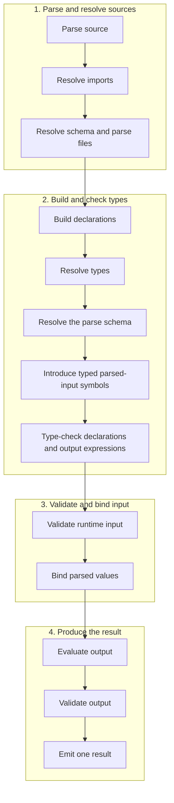

# Mace Language Specification

## 1. Status, conformance, and processing model

This document specifies Mace 1.0 and is normative. The repository's
[`mace.ebnf`](https://github.com/louiss0/mace/blob/main/mace.ebnf) is the
canonical syntax. A conforming implementation MUST implement both that grammar
and the static and evaluation semantics in this specification. Where the output
grammar is contextual, the selected output mode determines the applicable field
production before fields are interpreted. Backward-incompatible syntax or
semantic changes require a new language version; clarifications that do not
change accepted programs may update this specification in place.

Mace is a deterministic, strongly typed configuration language. Evaluation is
pure. A processor MUST emit exactly one fully validated record or schema result,
or an error. It MUST NOT emit partial output. Output roots MUST be records.
Variables are immutable, explicitly typed, and initialized. Mace has no loops,
functions, mutation, array indexing, arbitrary host calls, or shell execution.
Filesystem and HTTP(S) access occurs only while resolving explicit source paths
under Section 7; expressions cannot initiate I/O.

Processing occurs in this observable order:



Source MUST be UTF-8. Line endings may be LF, CRLF, or CR; CRLF is one newline.

## 2. Canonical grammar

The following fenced block MUST be an exact copy of `mace.ebnf`.

```ebnf
(* Mace canonical grammar. Semantic constraints are normative where noted. *)

(* LEXICAL STRUCTURE *)
whitespace = " " | "\t" | newline ;
newline = "\r\n" | "\n" | "\r" ;
line_comment = "//" , { ? any character except a line terminator ? } ;
block_comment = "/*" , { ? any character sequence not containing "*/" ? } , "*/" ;
comment = line_comment | block_comment ;
ws0 = { whitespace | comment } ;
ws1 = ( whitespace | comment ) , ws0 ;

unicode_letter = ? any Unicode character in category Letter ? ;
unicode_digit = ? any Unicode character in category Number, decimal digit ? ;
unicode_mark = ? any Unicode character in Unicode category Mark ? ;
digit = "0" | "1" | "2" | "3" | "4" | "5" | "6" | "7" | "8" | "9" ;
hex_digit = digit | "a"…"f" | "A"…"F" ;
identifier_part = unicode_letter | unicode_digit | unicode_mark | "_" ;
identifier =
    unicode_letter ,
    { identifier_part } ,
    { "-" , identifier_part , { identifier_part } } ;
(* After a complete identifier is recognized, processors normalize it to Unicode
   NFC before keyword classification and semantic name operations. Source ranges
   remain based on the original spelling. *)

inline_description = "/#" , ws0 , description_text ;
description_text =
    ? text up to, but not including, a comma, semicolon, closing brace, or line terminator ? ;

single_string = "'" , { single_character } , "'" ;
double_string = '"' , { double_part } , '"' ;
block_string = '"""' , { block_part } , '"""' ;
string_literal = single_string | double_string | block_string ;
single_character =
    ? any character except ', a line terminator, or backslash ?
  | escape_sequence ;
double_part =
    ? any character except ", a line terminator, backslash, or the start of "$(" ?
  | escape_sequence
  | interpolation ;
block_part =
    ? any character except backslash that does not begin the terminator or an interpolation ?
  | escape_sequence
  | interpolation ;

literal_single_string = "'" , { literal_single_character } , "'" ;
literal_double_string = '"' , { literal_double_character } , '"' ;
literal_block_string = '"""' , { literal_block_character } , '"""' ;
literal_string = literal_single_string | literal_double_string | literal_block_string ;
literal_single_character =
    ? any character except ', a line terminator, or backslash ?
  | escape_sequence ;
literal_double_character =
    ? any character except ", a line terminator, or backslash ?
  | escape_sequence ;
literal_block_character =
    ? any character except backslash, not beginning '"""' ?
  | escape_sequence ;
escape_sequence = "\\" , ( "\\" | "'" | '"' | "n" | "r" | "t" | unicode_escape ) ;
unicode_escape =
    "u" , hex_digit , hex_digit , hex_digit , hex_digit
  | "U" , hex_digit , hex_digit , hex_digit , hex_digit ,
          hex_digit , hex_digit , hex_digit , hex_digit ;

path_literal = "'" , { path_character } , "'" ;
path_character = ? any character except ', a line terminator, or backslash ? ;

int_literal = digit , { digit } ;
float_literal = digit , { digit } , "." , digit , { digit } ;
hex_int_literal = ( "0x" | "0X" ) , hex_digit , { hex_digit } ;
hex_float_literal =
    ( "0x" | "0X" ) , hex_digit , { hex_digit } , "." , hex_digit , { hex_digit } ;
boolean_literal = "true" | "false" ;
null_literal = "null" ;

(* DOCUMENT STRUCTURE *)
mace_file = ws0 , [ script_block , ws0 ] , output_block , ws0 ;
script_block =
    script_delimiter , ws0 ,
    { import_declaration , ws0 } ,
    { declaration , ws0 } ,
    script_delimiter ;
script_delimiter = "|" , "=" , "=" , "=" , { "=" } , "|" ;
(* Opening and closing script delimiters MUST contain equal numbers of '='. *)

import_declaration =
    "from" , ws1 , path_literal , ws1 ,
    ( "import" , ws1 , import_list | "bind" , ws1 , identifier ) ,
    ws0 , ";" ;
import_list = imported_identifier , { ws0 , "," , ws0 , imported_identifier } ;
imported_identifier = identifier , [ ws0 , ":" , ws0 , identifier ] ;

declaration =
    variable_declaration
  | type_declaration
  | schema_declaration
  | gen_doc_declaration
  | schema_doc_declaration ;
variable_declaration =
    type_reference , ws1 , identifier , ws0 , "=" , ws0 , expression ,
    [ ws0 , inline_description ] , ws0 , ";" ;
type_declaration =
    "alias" , ws1 , identifier , ws0 , ":" , ws0 , type_reference ,
    [ ws0 , inline_description ] , ws0 , ";" ;
schema_declaration =
    "schema" , ws1 , identifier , ws0 , ":" , ws0 , record_type , ws0 , ";" ;

gen_doc_declaration =
    "gen_doc" , ws1 , identifier , ws0 , "{" , ws0 ,
    [ gen_doc_entry , { ws0 , "," , ws0 , gen_doc_entry } , [ ws0 , "," ] ] ,
    ws0 , "}" , ws0 , ";" ;
gen_doc_entry =
    "summary" , ws0 , ":" , ws0 , literal_string
  | "description" , ws0 , ":" , ws0 , literal_block_string ;
schema_doc_declaration =
    "schema_doc" , ws1 , identifier , ws0 , "{" , ws0 ,
    [ schema_doc_entry , { ws0 , "," , ws0 , schema_doc_entry } , [ ws0 , "," ] ] ,
    ws0 , "}" , ws0 , ";" ;
schema_doc_entry =
    "summary" , ws0 , ":" , ws0 , literal_string
  | "description" , ws0 , ":" , ws0 , literal_block_string
  | "fields" , ws0 , ":" , ws0 , "{" , ws0 ,
    [ documentation_field ,
      { ws0 , "," , ws0 , documentation_field } , [ ws0 , "," ] ] ,
    ws0 , "}" ;
documentation_field = identifier , ws0 , ":" , ws0 , literal_string ;

(* TYPES *)
type_reference =
    primitive_type
  | array_type
  | record_map_type
  | record_type
  | fusion_type
  | variant_type
  | choice_type
  | identifier ;
primitive_type = "string" | "int" | "float" | "hex_int" | "hex_float" | "boolean" ;
array_type = "array" , ws0 , "<" , ws0 , type_reference , ws0 , ">" ;
record_map_type = "record" , ws0 , "<" , ws0 , type_reference , ws0 , ">" ;
record_type =
    "{" , ws0 ,
    [ schema_field , { ws0 , "," , ws0 , schema_field } , [ ws0 , "," ] ] ,
    ws0 , "}" ;
schema_field =
    identifier , [ "?" ] , ws0 , ":" , ws0 , type_reference ,
    [ ws0 , inline_description ] ;
fusion_type =
    "fusion" , ws0 , "[" , ws0 , type_reference ,
    { ws0 , "," , ws0 , type_reference } , [ ws0 , "," ] , ws0 , "]" ;
variant_type =
    "variant" , ws0 , "[" , ws0 , type_reference ,
    { ws0 , "," , ws0 , type_reference } , [ ws0 , "," ] , ws0 , "]" ;
choice_type =
    "choice" , ws0 , "[" , ws0 , choice_member ,
    { ws0 , "," , ws0 , choice_member } , [ ws0 , "," ] , ws0 , "]" ;
choice_member =
    literal_string
  | int_literal
  | float_literal
  | hex_int_literal
  | hex_float_literal
  | boolean_literal ;

(* OUTPUT *)
output_block =
    [ output_directive_list , ws0 ] ,
    "{" , ws0 , [ output_field_list ] , ws0 , "}" ;
(* output_field_list is contextual: data mode selects data_output_field_list;
   schema mode selects schema_output_field_list. *)
output_field_list = data_output_field_list | schema_output_field_list ;
data_output_field_list =
    data_output_field ,
    { ws0 , "," , ws0 , data_output_field } , [ ws0 , "," ] ;
schema_output_field_list =
    schema_output_field ,
    { ws0 , "," , ws0 , schema_output_field } , [ ws0 , "," ] ;
output_directive_list =
    "[" , ws0 , directive_pair ,
    { ws0 , "," , ws0 , directive_pair } , ws0 , "]" ;
directive_pair =
    "output" , ws0 , "=" , ws0 , ( "'data'" | "'schema'" )
  | "schema" , ws0 , "=" , ws0 , identifier
  | "schema_file" , ws0 , "=" , ws0 , path_literal
  | "parse" , ws0 , "=" , ws0 , identifier
  | "parse_file" , ws0 , "=" , ws0 , path_literal
  | "description" , ws0 , "=" , ws0 , expression ;
data_output_field =
    identifier , [ "?" ] , ws0 , ":" , ws0 , ( expression | null_literal ) ,
    [ ws0 , inline_description ]
  | identifier , [ ws0 , inline_description ] ;
schema_output_field =
    identifier , [ "?" ] , ws0 , ":" , ws0 , type_reference ,
    [ ws0 , inline_description ] ;

(* EXPRESSIONS *)
expression = conditional_expression ;
conditional_expression =
    coalescing_expression ,
    [ ws0 , "?" , ws0 , coalescing_expression ,
      ws0 , ":" , ws0 , coalescing_expression ] ;
coalescing_expression =
    logical_or_expression , [ ws0 , "??" , ws0 , coalescing_expression ] ;
logical_or_expression =
    logical_and_expression , { ws0 , "||" , ws0 , logical_and_expression } ;
logical_and_expression =
    bitwise_or_expression , { ws0 , "&&" , ws0 , bitwise_or_expression } ;
bitwise_or_expression =
    bitwise_xor_expression , { ws0 , "|" , ws0 , bitwise_xor_expression } ;
bitwise_xor_expression =
    bitwise_and_expression , { ws0 , "^" , ws0 , bitwise_and_expression } ;
bitwise_and_expression =
    equality_expression , { ws0 , "&" , ws0 , equality_expression } ;
equality_expression =
    relational_expression ,
    { ws0 , ( "==" | "!=" ) , ws0 , relational_expression } ;
relational_expression =
    shift_expression ,
    { ws0 , ( "<" | "<=" | ">" | ">=" ) , ws0 , shift_expression } ;
shift_expression =
    additive_expression ,
    { ws0 , ( "<<" | ">>" | ">>>" ) , ws0 , additive_expression } ;
additive_expression =
    multiplicative_expression ,
    { ws0 , ( "+" | "-" ) , ws0 , multiplicative_expression } ;
multiplicative_expression =
    exponent_expression ,
    { ws0 , ( "*" | "/" | "%" ) , ws0 , exponent_expression } ;
exponent_expression =
    unary_expression , [ ws0 , "**" , ws0 , exponent_expression ] ;
unary_expression =
    ( "!" | "~" | "+" | "-" ) , ws0 , unary_expression
  | postfix_expression ;
postfix_expression = primary_atom , { postfix_suffix } ;
primary_atom =
    identifier
  | self_reference
  | parsed_input_reference
  | int_literal
  | float_literal
  | hex_int_literal
  | hex_float_literal
  | string_literal
  | boolean_literal
  | array_literal
  | record_literal
  | match_expression
  | grouped_expression ;
postfix_suffix = ws0 , ( "." | "?." ) , ws0 , identifier ;
self_reference = "$self" , "." , identifier , { "." , identifier } ;
parsed_input_reference = "$" , identifier ;
grouped_expression = "(" , ws0 , expression , ws0 , ")" ;
array_literal =
    "[" , ws0 ,
    [ expression , { ws0 , "," , ws0 , expression } , [ ws0 , "," ] ] ,
    ws0 , "]" ;
record_literal =
    "{" , ws0 ,
    [ record_field , { ws0 , "," , ws0 , record_field } , [ ws0 , "," ] ] ,
    ws0 , "}" ;
record_field =
    identifier , ws0 , ":" , ws0 , expression , [ ws0 , inline_description ]
  | identifier , [ ws0 , inline_description ] ;
match_expression =
    "match" , ws0 , "(" , ws0 , expression , ws0 , ")" , ws0 ,
    "{" , ws0 , match_arm , { ws0 , match_arm } , ws0 , "}" ;
match_arm = match_pattern , ws0 , "=>" , ws0 , expression , ws0 , "," ;
match_pattern = type_reference | choice_member ;
interpolation = "$" , "(" , expression , ")" ;
```

## 3. Lexical rules

### 3.1 Identifiers and keywords

Identifiers are case-sensitive and use the grammar's Unicode categories.
Hyphenated segments may begin with a letter, decimal digit, or underscore.
Consequently `用户配置`, `naïve-value`, `foo-1`, and `foo-_internal` are valid.
After recognizing a complete identifier token, but before keyword classification or
semantic name resolution, processors MUST normalize the identifier to Unicode
Normalization Form C (NFC) as defined by Unicode Standard Annex #15. Identifier
equality, duplicate detection, field lookup, import resolution, export resolution,
and every other semantic name operation MUST use the NFC-normalized spelling.

Processors MUST preserve source ranges against the original unnormalized source
text. Normalization MUST NOT alter lexical source positions or diagnostic ranges.
NFC normalization applies only to identifiers and identifier-derived semantic names.
It MUST NOT alter string literals, path literals, comments, inline descriptions,
structured documentation text, or runtime string data.

If two source identifiers normalize to the same NFC spelling in a context where
duplicate names are forbidden, they are duplicate identifiers and processing MUST
fail using the applicable duplicate-name diagnostic. Processors MUST NOT apply
compatibility normalization, case folding, locale-dependent transformations,
transliteration, or confusable-character substitution. Tools SHOULD warn about
visually confusable names; confusable detection is separate from NFC normalization.

The globally reserved complete-token keywords are `from`, `import`, `bind`,
`alias`, `schema`, `gen_doc`, `schema_doc`, `array`, `record`, `fusion`,
`variant`, `choice`, `match`, `string`, `int`, `float`, `hex_int`, `hex_float`,
`boolean`, `true`, `false`, and `null`. `output`, `schema_file`, `parse`,
`parse_file`, `description`, `data`, `summary`, and `fields` are contextual
in their corresponding constructs. A keyword matches only a complete identifier
token: `matcher` is one identifier, not `match` followed by `er`. Contextual
keywords MAY be field names where the field grammar is unambiguous. A globally
reserved word used where an identifier is required is a syntax error.

Positive: `{ matcher: 1, output: 2, }`. Negative: `int match = 1;`.

### 3.2 Comments, strings, and descriptions

`//` comments end at a line ending or EOF. `/* ... */` comments end at the next
`*/` and do not nest. Double and block strings interpolate only with
`$(expression)`; single strings never interpolate. Backslashes in every string
form are consumed only by `escape_sequence`.

A Unicode escape MUST encode one Unicode scalar value. Values above `U+10FFFF`
and surrogate code points from `U+D800` through `U+DFFF` are errors.

Choice members and structured documentation use `literal_string`; interpolation
in either location is forbidden. An output `description` evaluates an expression
and MUST produce a string in either output mode. A path is a single-line,
non-interpolated, single-quoted `path_literal`.

Interpolation accepts only scalar runtime values. Strings are inserted unchanged;
`boolean` uses `true` or `false`; `int` uses base-10 notation; `float` uses the
shortest fixed-point decimal representation that round-trips to the same binary64
value; and hexadecimal values use their canonical output forms. Arrays, records,
types, schemas, and unresolved absence are errors.

Positive:

```mace
alias Mode: choice['dev', "prod", """test"""];
gen_doc Mode { summary: "Deployment mode", };
```

Negative: `alias Mode: choice["$(environment)"];` and
`gen_doc Mode { summary: "$(environment)", };`.

An inline description begins with `/#` and ends immediately before `,`, `;`, `}`,
or a line ending. The enclosing construct consumes that delimiter. It may annotate
a variable, alias, schema or inline-record field, runtime record field, or output
field. It MUST NOT consume a declaration terminator or closing brace.

```mace
string name = "Mace" /# before semicolon;
schema User: { name: string /# before comma, age?: int /# before brace };
{ name: "Mace" /# before output brace }
```

A second inline description on the same construct is invalid.

## 4. Document structure, declarations, and types

A file contains zero or one script block followed by exactly one output block.
Opening and closing script delimiters MUST have equal lengths. Imports precede
all declarations. Import, variable, alias, schema, and documentation declarations
MUST end in `;`. Type-like declarations may refer forward to local type-like
declarations. Variables are initialized and evaluated once in source order; a
variable initializer may use only values already introduced. All imported and
local declarations share one namespace, and shadowing is forbidden.

Primitive types are `string`, `int`, `float`, `hex_int`, `hex_float`, and
`boolean`. Arrays are homogeneous unless their declared element is a permitting
variant. `record<T>` maps identifier keys to `T`. Schemas and inline record types
are closed: required fields are present, optional fields may be absent, and
unknown fields are errors. `?` marks optional schema fields and optional
exported data-output fields; it never creates a runtime nullable value inside a
record.

An empty array defaults to `array<string>`; nested empty arrays apply that fallback
recursively. An expected variable or schema type may instead determine the array
element type while validating the expression. An empty record has no default
shape and requires an expected record type. In data output, an empty record,
including one nested in a conditional or record literal, requires `schema` or
`schema_file`. Empty schema-output records remain valid.

A fusion resolves entirely to records or entirely to choices. Record fusion
merges equal field types; required plus optional is required. Conflicting types
are errors. Choice fusion deduplicates the union of literal domains. A fusion
MUST NOT mix record and choice domains. Pure alias cycles are invalid.

Member access follows the declared shape. A required field on a definitely
present closed record uses `.`. An optional schema field and every `record<T>`
map lookup use `?.`; plain access is an error even when the current literal
contains that name. Optional access produces possible absence. Every later
access in that chain also uses `?.`, and `??` MUST resolve the absence before
assignment, interpolation, comparison, collection insertion, or output. Each
lookup consumes one declared record layer; access beyond that depth is an error.
Optional chaining does not narrow variants. A stable variant path MUST first be
narrowed by `match` before branch-specific members are accessed.

Named schema references may be recursive. A schema may refer to itself or to
another named schema in a field, including through a container such as
`array<Node>`:

```mace
schema Node: {
    value: string,
    children?: array<Node>,
};
```

The named schema identity supplies the recursive record shape. Anonymous inline
record types do not have a type-position `$self`; `$self` is reserved for
expression references during output evaluation.

## 5. Choices, variants, and matching

A choice is a non-empty, compile-time set of distinct scalar literals. Its
strings MUST be non-interpolating. A variant is an unordered set of distinct
resolved member types. A value assigned to a variant MUST satisfy exactly one
member, except that a primitive and a choice of that primitive may coexist as
separate declared alternatives.

A `match` input MUST have a choice or variant type and is evaluated exactly once.
Patterns introduce no bindings and there is no default or wildcard pattern.
Every source member MUST be covered exactly once, every arm MUST end with a
comma, and an out-of-domain, duplicate, overlapping, or missing pattern is an
error.

### 5.1 Choice matches

A choice match uses one literal pattern for every member of the resolved choice.
Type patterns are forbidden. Source order controls only presentation because the
literal domains are disjoint.

```mace
choice["on", "off"] state = "on";
int enabled = match (state) {
    "on" => 1,
    "off" => 0,
};
```

A missing literal, an unknown literal, a duplicate literal, or a type pattern
such as `string` is an error.

### 5.2 Variant matches

A variant match uses type-reference patterns. Literal patterns are forbidden.
A pattern may name one source member directly or name a variant alias that groups
multiple source members. Grouped patterns MUST remain disjoint from every other
arm and together the arms MUST cover the flattened source variant exactly once.

```mace
variant[string, int] value = 7;
string kind = match (value) {
    string => "text",
    int => "number",
};
```

```mace
alias TextOrNumber: variant[string, int];
alias ConfigValue: variant[string, int, boolean];
ConfigValue value = 7;

string category = match (value) {
    TextOrNumber => "content",
    boolean => "flag",
};
```

If the matched expression is a stable variable or member path, that existing
path is narrowed to the arm's resolved type while the arm result is checked.
Patterns do not create a new local name. Arm result types use the conditional
result-type rule in Section 8.

## 6. Output modes, shorthand, and `null`

Without directives, output mode is data. A bracketed list MUST contain exactly
one `output` directive whose value is the quoted literal `'data'` or `'schema'`.
Unknown and duplicate directives are errors. In schema mode, fields use
`schema_output_field`: right sides are types, `?` is allowed, and shorthand and
`null` are forbidden. Variable declarations are forbidden in a schema-output
file. In data mode, fields use `data_output_field`: right sides are expressions
or direct `null`, and `?` marks an output field as optional for importers. When
an output schema is selected, the marker is valid only if the corresponding
schema field is optional. `schema`, `schema_file`, `parse`, and `parse_file` are
invalid in schema mode.

The `description` directive may appear once in either mode and may be any
expression statically producing `string`. Schema-output files cannot declare
variables, but a description may use an imported runtime string.

A shorthand runtime record or data-output field `{ name }` is exactly
`{ name: name }`. It resolves one immutable value named `name` in the ordinary
local/imported value namespace. It does not search nested records, `$self`, or
parsed input. Parsed input therefore requires `$name`; `$self` requires an
explicit path. An unknown shorthand identifier is an error. Schema output never
permits shorthand.

Positive: `string name = "Mace"; ... { name }` and an imported value shorthand.
Negative: `{ userName }` when only `$userName` or `$self.userName` exists.

Data-output fields evaluate from top to bottom. `$self` is the data-output record
constructed so far and may read only a completed earlier field. It cannot read
the current field, a later field, script-private declarations, or parsed input.
A `$self` path may continue through nested closed records to the depth already
constructed. `$self` is invalid in schema output and in type positions.

`null` is not an expression or runtime value. It is legal only as the direct
value of a data-output field:

```mace
{ obsolete: null, }
```

The field expression is not evaluated and no null value is created. The field is
omitted before final output-schema validation. Omission succeeds for an optional
field and fails when the selected schema requires that field.

```mace
schema Result: { obsolete?: string, };
[output = 'data', schema = Result] { obsolete: null, } // valid
```

Invalid uses include `int value = null;`, `{ values: [null], }`,
`{ nested: { value: null }, }`, `{ result: enabled ? 1 : null, }`,
`{ same: null == null, }`, interpolation, and either side of `??`.

## 7. Imports, file directives, and paths

`from 'file.mace' import Name;` imports one exposed symbol under its name.
`import Name:LocalName;` imports it under `LocalName`. Ordinary imports can see
only symbols intentionally exposed by the referenced output: data-output fields
from a data file and schema-output fields/types from a schema file. Script
variables, aliases, schemas, and documentation are private unless represented by
an exposed output field. Duplicate local names, duplicate imports, missing
exposed names, and local declarations shadowing imports are errors.

`from 'file.mace' bind Name;` processes a referenced data-output file completely
and binds its output record as one immutable local value `Name`. Binding a
schema-output file is invalid. The referenced file must process successfully;
otherwise `bind` fails without creating a value.

```mace
from 'service.mace' import port;
from 'service.mace' import host:service-host;
from 'service.mace' bind service;
```

`schema_file = 'file.mace'` requires a schema-output file. Its output body is the
active output shape when `schema` is absent. When `schema = Name` is also present,
`Name` is resolved only among named schemas loaded from that same file; unrelated
local declarations are not candidates. `parse_file` behaves in parallel for
runtime input: without `parse`, its schema-output body is the input shape; with
`parse = Name`, the name resolves only in that file. File declarations needed to
resolve the selected exported schema are available internally but do not enter
the caller's namespace. Name collisions therefore cannot be resolved by leaking
private declarations. Wrong output mode, absent selection, duplicate selection,
or an incompatible directive combination is an error.

A `schema` or `parse` without its corresponding file resolves in the current
file's local named schemas. `schema_file` and `parse_file` relationships,
imports, and binds all participate in one dependency graph; any cycle is an
error.

An optional field imported from a data output is a nullable imported variable.
When absent, direct use and member access are errors. `??` resolves a possibly
absent scalar or collection value. A nullable imported record may also be the
condition of `?:`; it selects the true branch when present and narrows that
stable variable to its record type in the true branch. Ordinary local records
are not truthy conditions.

Every path MUST end in `.mace`. A local relative path resolves from its containing
file. Processors normalize separators and `.`/`..`, resolve symlinks, canonicalize
the target and project root, and reject local targets outside the canonical root.
Raw string-prefix containment is insufficient.

A path may instead be an absolute `http://` or `https://` URL. Relative paths in
a remotely loaded source resolve against that source URL. Remote dependency
resolution accepts only HTTP(S), preserves the root scheme and host for nested
remote paths, and rejects a resolved path outside the remote root path. FTP,
interpolated URLs, and URLs not ending in `.mace` are errors. Remote retrieval is
source resolution, not expression evaluation; a retrieval or non-success status
error terminates processing without partial output.

Positive cases include named/renamed imports, binding a data file, local and
HTTP(S) source paths, and each file directive with or without its selector.
Negative cases include binding a schema file, collisions, missing selections,
wrong modes, cycles, local `..` or symlink escapes, remote origin/root escapes,
and unsupported URL schemes.

## 8. Expressions and operators

Operands evaluate left-to-right except where laziness is stated. Checked
operations MUST report an operator/type, overflow, division, shift, exponent, or
non-finite-result diagnostic as applicable. Decimal (`int`, `float`) and
hexadecimal (`hex_int`, `hex_float`) families MUST NOT mix. Within one family,
integer/float arithmetic promotes the integer operand to that family's float.
No other implicit numeric conversion occurs.

| Operators | Operands | Result | Precedence | Associativity / evaluation |
| --- | --- | --- | ---: | --- |
| `.`, `?.` | record/schema target and member | member type; `?.` produces possible absence | 15 | left; target first |
| `!` | `boolean` | `boolean` | 14 | right |
| `~` | `int` only | `int` | 14 | right |
| unary `+`, `-` | any numeric scalar | same type | 14 | right; checked for integer minimum negation |
| `**` | same-family numeric scalars | promoted family type | 13 | right; see below |
| `*`, `/`, `%` | same-family numeric scalars; hexadecimal `%` requires two `hex_int` values | promoted type, except `int/int → int`, `hex_int/hex_int → hex_float` for `/` | 12 | left |
| `+`, `-` | same-family numeric scalars | promoted numeric type | 11 | left |
| `<<`, `>>`, `>>>` | `int/int` or `hex_int/hex_int` | operand type | 10 | left |
| `<`, `<=`, `>`, `>=` | same-family numeric scalars | `boolean` | 9 | left |
| `==`, `!=` | same scalar type, or two hexadecimal numeric scalars | `boolean` | 8 | left |
| `&` | `int/int` or `hex_int/hex_int` | operand type | 7 | left |
| `^` | `int/int` or `hex_int/hex_int` | operand type | 6 | left |
| `|` | `int/int` or `hex_int/hex_int` | operand type | 5 | left |
| `&&` | `boolean/boolean` | `boolean` | 4 | left, lazy right |
| `||` | `boolean/boolean` | `boolean` | 3 | left, lazy right |
| `??` | possibly absent left; compatible present right | unified present type | 2 | right; lazy right |
| `?:` | `boolean`, or a nullable imported record; compatible branches | branch union described below | 1 | right syntactically; selected branch only |

Booleans have no bitwise operators. Strings support equality but not `+` or
relational ordering. Arrays and records do not support equality. Equality across
distinct scalar types is invalid except between `hex_int` and `hex_float`, which
compares their numeric values. Choice values compare according to their underlying
scalar only when both operands have the same declared choice type.

`int` and `hex_int` use signed 64-bit storage. Decimal integer arithmetic follows
signed 64-bit two's-complement results. Hexadecimal integer addition,
subtraction, multiplication, negation, exponentiation, and left shift are checked
and MUST NOT overflow. Integer division truncates toward zero. Integer remainder
satisfies `a == (a / b) * b + a % b` and has the dividend's sign. Decimal modulo
with an `int` and/or `float` promotes to `float` and uses floating-point remainder;
hexadecimal modulo requires two `hex_int` operands. Division or remainder by zero
is an error.

Exponentiation accepts same-family numeric operands. Two integer operands use
integer exponentiation and require a non-negative exponent. If either operand is
a float, both operands are evaluated in that family's float type and the exponent
may be fractional or negative. Zero to a negative exponent is division by zero.
A negative base with a non-integer exponent is invalid because it would produce
a non-finite real result. Any non-finite result is an error.

Shift operands MUST use one integer family: `int` with `int`, or `hex_int` with
`hex_int`. Counts MUST be non-negative. `>>` is arithmetic signed right shift.
`>>>` shifts the 64-bit representation right with zero fill and reinterprets the
bits as the left operand type. Hexadecimal left shift is checked for signed
64-bit overflow.

`&&` skips its right operand when left is false; `||` skips it when left is true.
`?:` evaluates the condition and exactly one branch. A nullable imported record
is true when present and false when absent; in its true branch that stable
variable is narrowed to the present record type. Nested conditional expressions
are forbidden. Equal branch types retain that type; distinct types form a
flattened, deduplicated `variant[...]`, and the receiving declaration or schema
MUST accept every member.

`??` handles absence from optional access, never `null`. It evaluates left first
and right only if left is absent. Its static result removes absence from the left
and unifies that present type with the right type using the conditional branch
rule. Chaining is right-associative.

Examples: `false && (1 / 0 == 0)` and `true || (1 / 0 == 0)` do not divide;
`optional?.name ?? "anonymous"` evaluates the fallback only when absent.
Negative examples include `1 + 0x1`, `true & false`, `0x1 << 1`, `1 / 0`,
`"a" < "b"`, and `"1" == 1`.

Parentheses may group any expression, just as in other languages. They can
change precedence or associativity, such as `(1 + 2) * 3`, `1 - (2 - 3)`,
or `(ready && enabled) || fallback`, and they may also be used for visual
clarity. Redundant parentheses are valid. Formatters MAY remove parentheses
when doing so preserves the expression's meaning.

## 9. Numeric representation

`int` and `hex_int` are signed 64-bit. `float` and `hex_float` use IEEE-754
binary64. Hex fixed-point literals have no exponent notation. Decimal and
hexadecimal types remain distinct.

Decimal- and hex-float conversion use IEEE-754 round-to-nearest, ties-to-even.
A literal is rejected if rounding would produce infinity; values are never
clamped. The same rule applies symmetrically to negative values. Underflow rounds
to a subnormal or signed zero according to ties-to-even. Negative zero is
preserved. NaN and infinity cannot be written and any operation producing a
non-finite value fails.

Canonical `hex_float` output uses uppercase hexadecimal digits, fixed-point
notation, an exact binary64 expansion, and a fractional component. Fractional
trailing zeroes are removed but `.0` remains. Parsing canonical output MUST
recover the identical bit pattern, including negative zero.

Positive: `0xA.F` is `10.9375`; the smallest representable subnormal and finite
boundary values round according to ties-to-even. Negative: a magnitude whose
nearest binary64 result is infinity.

## 10. Documentation

Documentation is metadata and MUST NOT affect evaluation. `gen_doc` applies to
primitive/array variables, aliases, and choices. `schema_doc` applies to schemas
and record-valued variables. Imported targets MUST instead be documented with
the matching directive in the file that exports them. Unknown, duplicate,
premature, or inapplicable targets and keys are errors. `fields` exists only in `schema_doc` and each named
field MUST exist. Structured values are non-interpolating strings. Inline and
structured documentation MUST NOT conflict.

## 11. Diagnostics and security

Every lexical, syntax, static, resolution, or evaluation error terminates
processing. A diagnostic MUST identify the failing construct when a source range
exists. Exact fragments below are normative where quoted; implementations MAY
add context.

Required distinct categories include:

* mismatched, unterminated, or empty script blocks; misplaced imports; missing
  terminators; malformed declarations/directives/fields; missing or extra output;
* missing field separators (`expected ',' after field` or `expected ',' or '}'
  after field`);
* missing/duplicate/unknown directives and data-only directives in schema mode;
* unknown, duplicate, private, or shadowed imports; `unresolved bind`; `bind target
  must use data output`; file-selection/mode failures; cycles and path escapes;
* duplicate declarations, fields, choice members, or variant members; unknown
  types/values; cycles; invalid fusion; schema mismatch; and an empty record
  output without schema context;
* `null is only allowed in output` for every illegal runtime use, including
  nested, conditional, collection, interpolation, comparison, and coalescing
  positions;
* `choice literals must not interpolate` and `structured documentation must not interpolate`;
* match input outside variant/choice; `choice match arms require a literal
  pattern`; `variant match arms require a type pattern`; non-exhaustive matches
  (`match expression must be exhaustive`); duplicate patterns (`duplicate match
  pattern`); and patterns outside the source domain;
* invalid operand combinations, checked hexadecimal integer overflow, division
  by zero, invalid exponent or shift, and non-finite floating-point results;
* optional plain access, access beyond declared depth, and unresolved absence
  (`possibly absent expressions must be resolved with '??' before use`);
* keyword in an identifier position, malformed/unterminated inline descriptions,
  and duplicate or conflicting documentation.

The repository's processor, parser, formatter, analyzer, and diagnostic test
suites are the executable Mace 1.0 conformance suite. A behavior change is not
conforming until the normative specification and positive and negative tests are
updated together.

Processors MUST treat source files, imports, runtime input, documentation,
strings, and emitted values as data. They MUST validate runtime input before
binding parsed references, enforce local or remote source boundaries, reject
cycles, and never leak partial output.